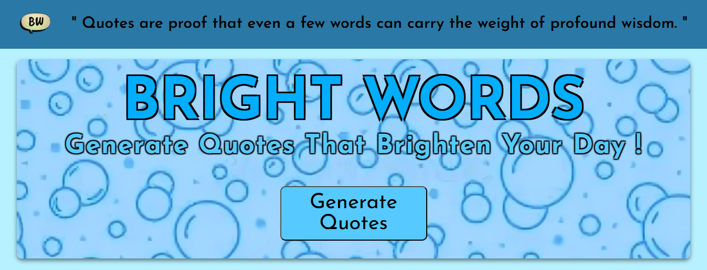
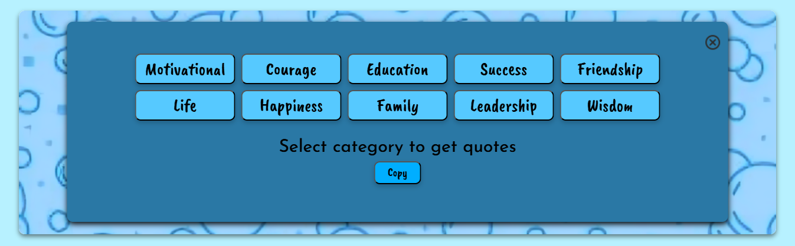

# Bright Words - Random Quotes Generator
## 🚀 Overview
Bright Words is a simple and visually appealing web application that generates inspirational quotes across multiple categories. Users can explore pre-listed quotes on the page or generate random quotes by selecting a category through an interactive modal. The app also includes a one-click copy feature, making it easy to save or share quotes instantly. This project focuses on clean UI design, smooth user interaction, and beginner-friendly JavaScript logic.

 

## 🚀 Screenshots

  

 

## 🚀 Features
- Random Quote Generation by category
- Multiple Quote Categories (Motivational, Success, Friendship, etc.)
- Dynamic Header Quote that changes on every page load
- One-click Copy to Clipboard functionality
- Attractive & Responsive UI for desktop and mobile devices
- Interactive Modal Popup for category-based quote generation
- Fast & Lightweight (no external libraries or frameworks)

 

## 🚀 Tech Stack
- **HTML5** – Structure and semantic layout
- **CSS3** – Styling, animations, and responsive design
- **JavaScript** – Dynamic content, random quote logic, and interactivity

 

## 🚀 Deployment
The app is deployed on <b>Vercel</b> and can be accessed via:
 
https://bright-words.vercel.app/

 

## 🚀 Contact
- LinkedIn: www.linkedin.com/in/ibadhussain